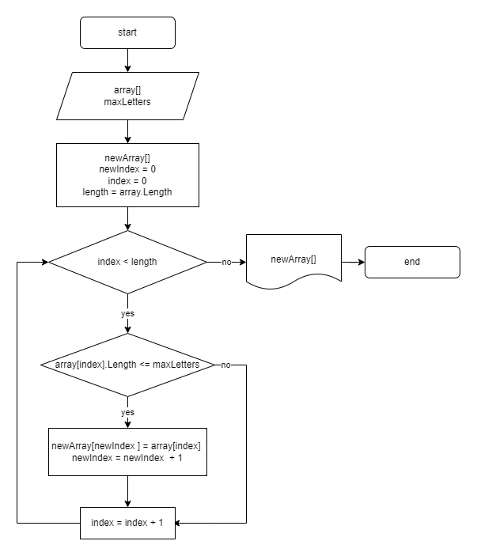

# Проверочная работа по базовому знакомству с IT

## Задача
Написать программу, которая из имеющегося массива строк формирует массив строк, длина которых меньше либо равна 3 символам.
Первоначальный массив можно ввести с клавиатуры, либо задать на старте выполнения алгоритма.

&nbsp;

1. В решении задачи буду исходить из того, что программа принимает на вход изначальный массив и максимальный размер строки формируемого массива, чтобы не ограничиваться только 3 символами.

1. Алгоритм следующий:
    + в цикле проходим по всем элементам первоначального массива;
    + сравниваем по условию длину каждой строки массива с заданным максимальным размером;
    + если условие выполняется, записываем значение в новый массив;
    + по завершению цикла, выводим получившийся массив.

1. Блок-схема:

    

1. Вводить первоначальный массив с клавиатуры ~~хрень какая-то~~ на мой взгляд не рационально, поэтому пишем метод, который возвращает массив строк из случайных символов, а на вход принимает длину массива и максимальную длину строки.

    ````C#
    string[] createArrayRandSrt(int max, int length){
        string[] simbols = new string[]{"а","б","в","г","д","е","ё","ж","з","и",
                                        "й","к","л","м","н","о","п","р","с","т",
                                        "у","ф","х","ц","ч","ш","щ","ъ","ы","ь",
                                        "э","ю","я","0","1","2","3","4","5","6",
                                        "7","8","9","-"," "},
            arrayStr = new string[length];
        string word = String.Empty;
        int index = 0,
            wordLength = 0;
        for (int i = 0; i < length; i++){
            word = "";
            wordLength = new Random().Next(1, max + 1);
            for (int j = 0; j < wordLength; j++){
                index = new Random().Next(0, simbols.Length);
                word += simbols[index];
            }
            arrayStr[i] = word;
        }
        return arrayStr;
    }
    ````

1. Далее пишем метод для вывода массива на экран
    ````C#
    void printArray(string[] array){
        Console.Write("[");
        int length = array.Length;
        for(int i = 0; i < length; i++){
            Console.Write($"\"{array[i]}\"");
            if(i + 1 != length) Console.Write(", ");
        }
        Console.Write("]\n");
    }
    ````
    Вообще можно было бы использовать цикл `foreach`, но он работает только со значениями, а чтобы вывести массив "красиво", с запятыми, необходимо отследить индекс, поэтому `for`.

1. Максимальную длину строки для нового массива (3 символа), будем запрашивать у пользователя. Так нагляднее и проще проверить работу. Но так как это не единственный вариант ее "получения" делаем для этого отдельный метод.
    ````C#
    int getMaxValue(){
        Console.Write("\nВведите максимальную длину строи для фильтрации массива: ");
        int max = Convert.ToInt32(Console.ReadLine());
        return max;
    }
    ````
    Сюда можно и проверку добавить, но я и так слишком увлекся этим ~~бесполезным~~ проверочным заданием.
1. Далее основной метод этой программы - создание нового массива или фильтрация входящего.
    ````C#
    string[] filterStrLength(string[] array, int max){
        int length = array.Length,
            index = 0;
        string[] result = new string[length];
        for (int i = 0; i < length; i++){
            if(array[i].Length <= max){
                result[index] = array[i];
                index += 1;
            }
        }
        Array.Resize(ref result, index);
        return result;
    }
    ````
    Здесь все просто, объявляем новый массив длиной равной входящему(вдруг все значения удовлетворяют), и переменную `index` с индексом элемента нового массива, который при срабатывании условия заполняем. После цикла c помощью `index` и метода `Array.Resize` "обрезаем" массив до реального размера.

1. Тело основной программы:
    ````C#
    int aiMaxStr = 9,
        aiLength = 13;
    string[] arrayInput  = createArrayRandSrt(aiMaxStr, aiLength);
    Console.WriteLine("Первоначальный массив:");
    printArray(arrayInput);
    int maxLengthStr = getMaxValue();
    string[] arrayResult = filterStrLength(arrayInput, maxLengthStr);
    Console.Write("Результат: ");
    printArray(arrayResult);
    ````
    Думаю, здесь нечего пояснять. На этом всё.
    > Работа работой, но в этой жизни надо еще и что-то полезное делать.<br>
    _Хенрик Ягодзиньский_


